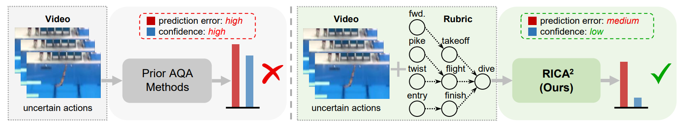
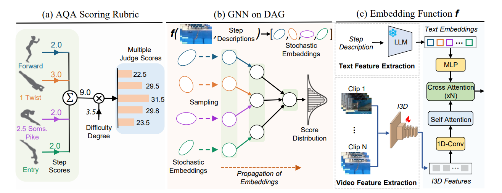
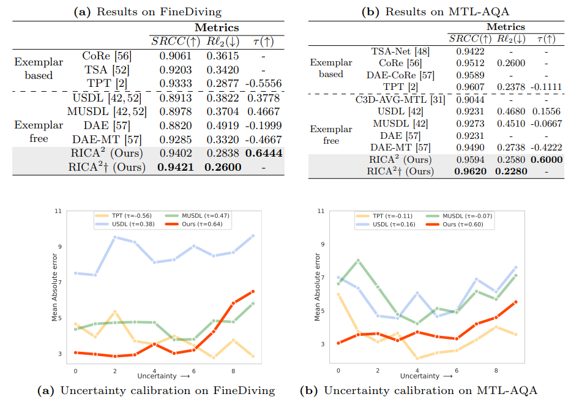

# RICA<sup>2</sup>: Rubric-Informed, Calibrated Assessment of Actions (ECCV 2024)

[](https://abrarmajeedi.github.io/rica2_aqa/)
[](https://arxiv.org/abs/2408.02138)


## Abstract


  
The ability to quantify how well an action is carried out, also known as action quality assessment (AQA), has attracted recent interest in the vision community. Unfortunately, prior methods often ignore the score rubric used by human experts and fall short of quantifying the uncertainty of the model prediction. To bridge the gap, we present RICA^2 - a deep probabilistic model that integrates score rubric and accounts for prediction uncertainty for AQA. Central to our method lies in stochastic embeddings of action steps, defined on a graph structure that encodes the score rubric. The embeddings spread probabilistic density in the latent space and allow our method to represent model uncertainty. The graph encodes the scoring criteria, based on which the quality scores can be decoded. We demonstrate that our method establishes new state of the art on public benchmarks, including FineDiving, MTL-AQA, and JIGSAWS, with superior performance in score prediction and uncertainty calibration


## Method 
  



## Results





## Code
Please find the installation instructions in [INSTALL.md](./INSTALL.md)

Instructions to run the code can be found in [ GETTING_STARTED.md](./GETTING_STARTED.md)


## Citation
If you find our work useful, please consider citing:

```bibtex
@article{majeedi24rica2,
    title={RICA^2: Rubric-Informed, Calibrated Assessment of Actions}, 
    author={Majeedi, Abrar and Gajjala, Viswanatha Reddy and GNVV, Satya Sai Srinath Namburi and Li, Yin},
    year={2024},
    booktitle={European conference on computer vision},
    primaryClass={cs.CV}
}
```


## Contact
Email: majeedi+at+wisc+dot+edu
